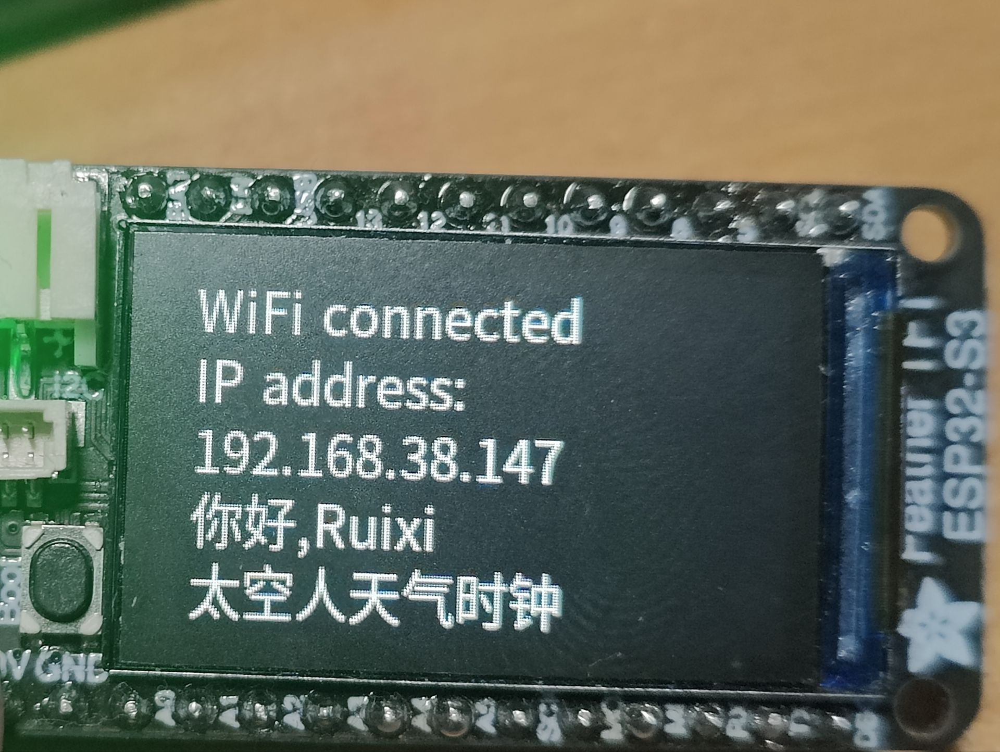
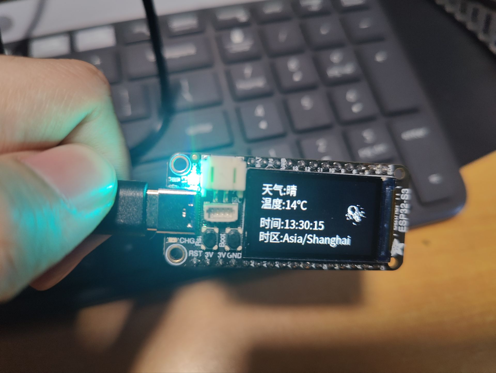
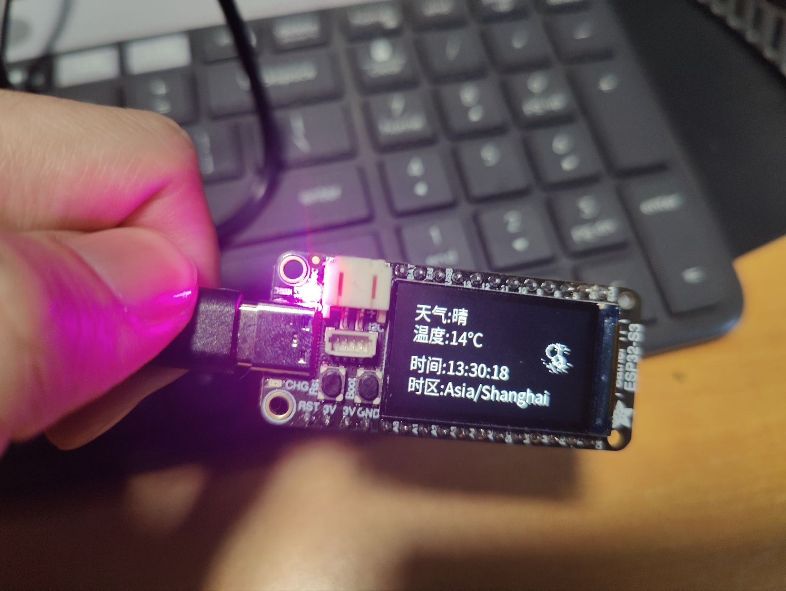
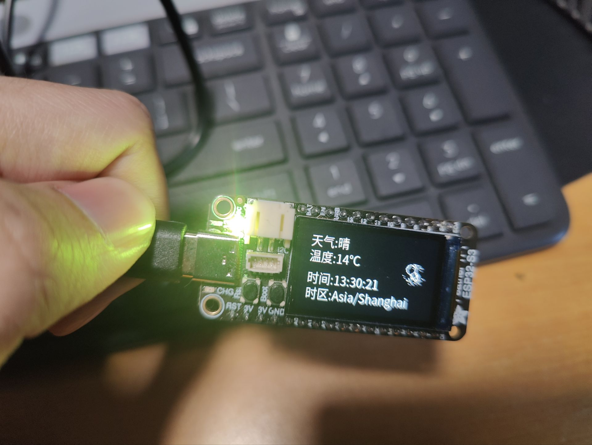
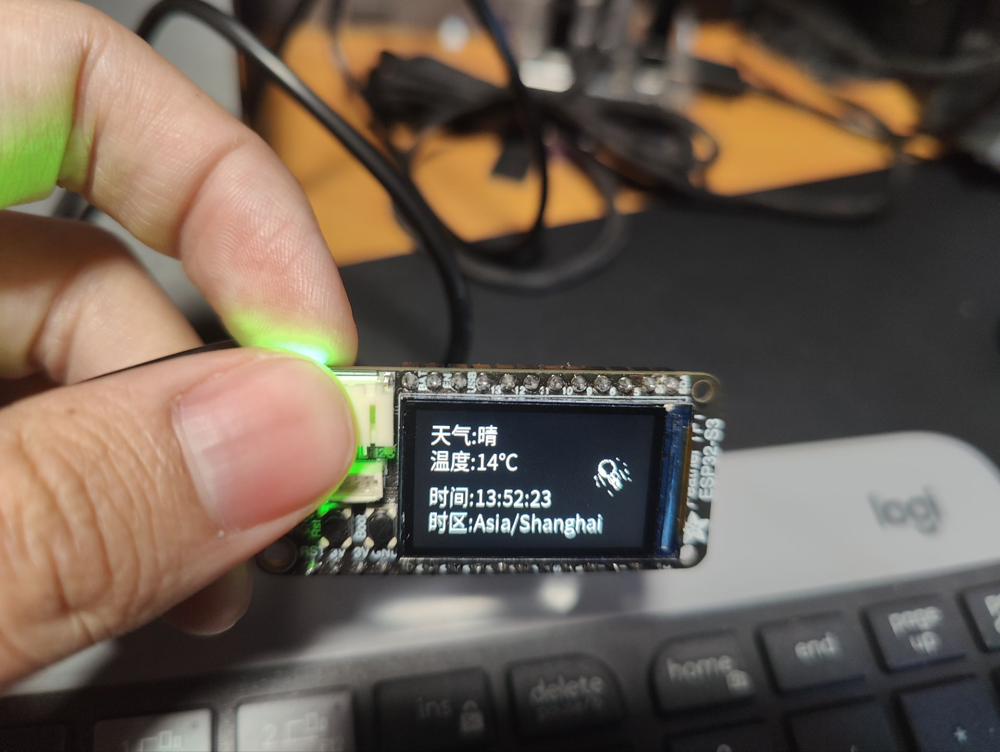

#【得捷电子Follow me第2期】任务汇总 ESP32S3太空人天气时钟

EE_Wrold大学堂视频链接: http://training.eeworld.com.cn/video/38556

### 介绍
```c
一个基于ESP32的天气时钟,通过心知天气的免费天气API和WorldTime时间API获得数据,显示在TFT-spi屏上.
源码:c/c++
平台:Vscode,PlatformIO
采用FreeRTOS来控制多任务

xTaskCreate(
    LEDCtrl,        // 任务函数
    "LEDCtrl",      // 任务名字
    1536,           // 任务堆栈大小
    NULL,           // 传递给任务函数的参数
    3,              // 任务优先级
    &LEDCtrl_Handle // 任务句柄
);
xTaskCreate(
    NetCtrl,
    "NetCtrl",
    8192,
    NULL,
    4,
    &NetCtrl_Handle);
//vTaskDelay(500);
xTaskCreate(
    DisplayCtrl,
    "DisplayCtrl",
    2048,
    NULL,
    2,
    &DisplayCtrl_Handle
);
```
---
### 任务一:控制屏幕显示中文
通过`TFT-eSPI`库控制屏幕
```c
#include <SPI.h>
#include <TFT_eSPI.h>
```

在使用之前,先要按需修改User_Setup.h文件

```c
...
#define ST7789_DRIVER   //该开发板使用ST7789屏幕驱动
...
#define TFT_WIDTH 135   //定义屏幕的宽和高
#define TFT_HEIGHT 240
...
#define TFT_BL 45    //定义背光控制引脚
...
//定义信号脚,时钟脚,复位脚等其他引脚(查询电路原理https://github.com/adafruit/Adafruit-ESP32-S3-TFT-Feather-PCB图)
#define TFT_MISO 37 
#define TFT_MOSI 35
#define TFT_SCLK 36
#define TFT_CS 7   // Chip select control pin (library pulls permanently low
#define TFT_DC 39  // Data Command control pin - must use a pin in the range 0-31
#define TFT_RST 40 // Reset pin, toggles on startup
...
#define SMOOTH_FONT //开启smooth font,以方便后面中文显示
```
这样就设置好了
在`main.c`中,我们要进行初始化
```c
TFT_eSPI tft = TFT_eSPI();  ///创建屏幕对象
...
void Displayinit()
{
  pinMode(21, OUTPUT); // TFT电源脚置1
  digitalWrite(21, 1);
  tft.init();         // st7789屏幕初始化
  tft.setRotation(1); // 屏幕旋转90度
  tft.fillScreen(TFT_BLACK);    //全屏填充黑色(即清屏)
  tft.setTextColor(TFT_WHITE, TFT_BLACK);   //设置前景色与背景色
  tft.setTextSize(1);
}

```
然后,我们可以这样使其在屏幕上绘制出文字
```c
tft.loadFont(noto_sans_cjk20);  //在使用前需要先加载字库文件
... 
tft.setCursor(15, 110); //设置坐标开始位置
tft.print("太空人天气时钟");
...
tft.unloadFont();   // 显示完后即可释放字库,节省RAM
```
关于字库文件:
在该库中作者就贴心的为我们准备了一个字库生成工具,可以让我们很方便的用本地的字体文件和所需字符的Unicode来生成我们所需的字库


任务一效果展示:


----
### 任务2：网络功能使用
网络功能我们则使用`WiFi`库
```c
#include <WiFi.h>
```
初始化
```c
void Netinit()
{
  WiFi.mode(WIFI_AP_STA);               // Esp32 WiFi模式设置
  WiFi.begin("RuixisNet", "PASSWORD"); // Esp32 联网ssid和passwd设置
  WiFi.softAP("qwert", "password");     // Esp32 Access Point ssid和passwd设置
}
```
模式设置为AP_STA模式,可以同时连接WiFi和创建热点

热点功能演示:


---
###任务三:任务3：控制WS2812B
开发板上配了一颗Neopixel WS2812灯珠,原来想使用`FastLED`库的,但是发现Adafruit官方有自己的Neopixel库,就直接拿来用了
```c
#include <Adafruit_NeoPixel.h>
```
初始化
```c
Aafruit_NeoPixel pixels(LED_NUM, LED_Ctrl_PIN, NEO_GRB + NEO_KHZ800);   //创建Neopixel对象
...
void LEDinit()
{
  pinMode(34, OUTPUT); // NeoPixel电源脚
  digitalWrite(34, HIGH);

  pixels.begin(); // NeoPixel灯珠初始化
  pixels.clear(); // 关闭灯珠
}
```
在主程序中,可以通过这样的命令控制灯珠的颜色与亮度
```c
pixels.setPixelColor(0, pixels.Color(255, 0, 0)); //设置灯柱颜色(红)
pixels.show();  //灯珠颜色刷新
```
然后可以写一个简单的走马灯程序
```c
void LEDCtrl(void *Parameters)
{
  while (1)
  {
    // NeoPixel 流水灯实现
    for (int i = 0; i < 256; i++)
    {
      pixels.setPixelColor(0, pixels.Color(255 - i, i, 0));
      pixels.show();
      vTaskDelay(10);
    }
    for (int i = 0; i < 256; i++)
    {
      pixels.setPixelColor(0, pixels.Color(0, 255 - i, i));
      pixels.show();
      vTaskDelay(10);
    }
    for (int i = 0; i < 256; i++)
    {
      pixels.setPixelColor(0, pixels.Color(i, 0, 255 - i));
      pixels.show();
      vTaskDelay(10);
    }
  }
  vTaskDelete(LEDCtrl_Handle);
}
```
效果展示:




---
### 任务4.1 日历&时钟——完成一个可通过互联网更新的万年历时钟，并显示当地的天气信息
使用库文件:
```c
#include <HTTPClient.h> //通过HTTP协议获取API数据
#include <ArduinoJson.h>    //用于解析API获取的数据
#include <ESP32Time.h>  //ESP硬件时间控制
```
初始化:
```c
ESP32Time rtc(3600 * 8); // 时区偏移量 GMT+8(/Asia/Shanghai)
```
天气数据获取:
```c
void Get_weather_data()
{
  HTTPClient http;
  url = "https://api.seniverse.com/v3/weather/now.json?key=***YOUR_API_KEY***&location=hefei&language=zh-Hans&unit=c"; // 设置目标网站的URL
  http.begin(url);
  int httpCode = http.GET();

  if (httpCode == HTTP_CODE_OK)
  {
    // 获取并解析响应的Json数据
    String response = http.getString();
    DynamicJsonDocument doc(1024);
    deserializeJson(doc, response);

    JsonObject results_0 = doc["results"][0];
    JsonObject results_0_now = results_0["now"];
    weather = results_0_now["text"].as<String>();
    temperature = results_0_now["temperature"].as<String>();
    DeserializationError error = deserializeJson(doc, response);
  }
  else if (httpCode < 0)
  {
    weather = "error";
    temperature = "error";
  }

  http.end(); // 关闭HTTP连接
}
```
API响应的数据如下:
```json
{
    "results": [
        {
            "location": {
                "id": "WTEMH46Z5N09",
                "name": "合肥",
                "country": "CN",
                "path": "合肥,合肥,安徽,中国",
                "timezone": "Asia/Shanghai",
                "timezone_offset": "+08:00"
            },
            "now": {
                "text": "晴",
                "code": "0",
                "temperature": "14"
            },
            "last_update": "2023-11-25T13:20:12+08:00"
        }
    ]
}%
```
数据原本类型为`Sring`
我们可以通过`ArduinoJson`库创建一个`doc`字典数组来解析数据
```c
deserializeJson(doc, response); //将响应的数据反序列化存入字典数组doc

JsonObject results_0 = doc["results"][0];   //一层一层解析该数组,最后获得我们想要的天气和气温数据
JsonObject results_0_now = results_0["now"];
weather = results_0_now["text"].as<String>();
temperature = results_0_now["temperature"].as<String>();
```
最后的结果:
```c
weather = "晴";
temperature = "14";
```
同理,我们也用相同办法获得时间数据
```c
void Sync_time()
{
  HTTPClient http;
  url = "http://worldtimeapi.org/api/timezone/Asia/Shanghai"; // 设置目标网站的URL
  http.begin(url);
  int httpCode = http.GET();

  if (httpCode == HTTP_CODE_OK)
  {
    // 获取并解析响应的Json数据
    String response = http.getString();
    DynamicJsonDocument doc(1024);
    deserializeJson(doc, response);

    timezone = doc["timezone"].as<String>();
    unixtime = doc["unixtime"].as<String>();

    rtc.setTime(unixtime.toInt());
  }
  else if (httpCode < 0)
  {
    timezone = "error";
    unixtime = "error";
  }
  http.end();
}
```
这里用到了`SP32Time`库,将获取到的Unix时间戳同步到本地
```c
rtc.setTime(unixtime.toInt());
```
最后把所有数据在屏幕上输出就行啦
```c
void Show_weather()
{
  tft.fillRoundRect(15, 15, 160, 45, 0, TFT_BLACK);
  tft.setCursor(15, 15);
  tft.print("天气:");
  tft.print(weather);
  tft.setCursor(15, 40);
  tft.print("温度:");
  tft.print(temperature);
  tft.print("℃");
}

void Show_time()
{
  tft.fillRoundRect(15, 75, 160, 45, 0, TFT_BLACK);
  tft.setCursor(15, 75);
  tft.print("时间:");
  tft.print(rtc.getTime());
}

void Show_timezone()
{
  tft.fillRoundRect(15, 135, 160, 45, 0, TFT_BLACK);
  tft.setCursor(15, 100);
  tft.print("时区:");
  tft.print(timezone);
}

...

void DisplayCtrl(void *Parameter)
{
  tft.fillScreen(TFT_BLACK);
  while (1)
  {
    for (int i = 0; i < 5; i++)
    {
      Show_astronaut();
      vTaskDelay(200);
    }
    tft.loadFont(noto_sans_cjk20);
    Show_weather();
    Show_time();
    Show_timezone();
    tft.unloadFont();
  }

  vTaskDelete(DisplayCtrl_Handle);
};
```
效果展示:


---
### 心得体会
活动挺好的,学到了http协议相关知识.能嫖板子!!!
多多进行!!!

---
### main.c源码
其他相关文件见 https://github.com/Ruixi-Orange/Esp32-Weather-Clock
```c
//
//  头文件
//
#include <string.h>
#include <Arduino.h>
#include <Adafruit_NeoPixel.h>
#include <SPI.h>
#include <TFT_eSPI.h>
#include <WiFi.h>
#include <HTTPClient.h>
#include <FreeRTOS.h>
#include <ArduinoJson.h>
#include <ESP32Time.h>
#include "astronaut.h"
#include "noto_sans_cjk20.h"

//
//  宏定义
//
#define LED_NUM 1
#define LED_Ctrl_PIN 33

//
//  全局变量定义
//
TaskHandle_t LEDCtrl_Handle;
TaskHandle_t DisplayCtrl_Handle;
TaskHandle_t NetCtrl_Handle;
String url;
String weather;
String temperature;
String timezone;
String unixtime;  //unix时间戳
uint8_t update_flag = 0;
uint8_t frameIndex = 0; // 太空人动画帧索引

//
//  Init
//
Adafruit_NeoPixel pixels(LED_NUM, LED_Ctrl_PIN, NEO_GRB + NEO_KHZ800);
TFT_eSPI tft = TFT_eSPI();
ESP32Time rtc(3600 * 8); // 时区偏移量 GMT+8

//
//  函数
//
void LEDinit();
void Displayinit();
void Netinit();
void Get_weather_data();
void Sync_time();
void Show_astronaut();
void Show_weather();
void Show_time();
void Show_timezone();

void init()
{
  LEDinit();
  Displayinit();
  Netinit();
}

void LEDinit()
{
  pinMode(34, OUTPUT); // NeoPixel电源脚
  digitalWrite(34, HIGH);

  pixels.begin(); // NeoPixel灯珠初始化
  pixels.clear(); // 关闭灯珠
}

void Netinit()
{
  WiFi.mode(WIFI_AP_STA);               // Esp32 WiFi模式设置
  WiFi.begin("RuixisNet", "PASSWORD"); // Esp32 联网ssid和passwd设置
  WiFi.softAP("qwert", "password");     // Esp32 Access Point ssid和passwd设置
}

void Displayinit()
{
  pinMode(21, OUTPUT); // TFT电源脚
  digitalWrite(21, 1);
  tft.init();         // st7789屏幕初始化
  tft.setRotation(1); // 屏幕旋转90度
  tft.fillScreen(TFT_BLACK);
  tft.setTextColor(TFT_WHITE, TFT_BLACK);
  tft.setTextSize(1);
}

void Get_weather_data()
{
  HTTPClient http;
  url = "https://api.seniverse.com/v3/weather/now.json?key=***YOUR_API_KEY***&location=hefei&language=zh-Hans&unit=c"; // 设置目标网站的URL
  http.begin(url);
  int httpCode = http.GET();

  if (httpCode == HTTP_CODE_OK)
  {
    // 获取并解析响应的Json数据
    String response = http.getString();
    DynamicJsonDocument doc(1024);
    deserializeJson(doc, response);

    JsonObject results_0 = doc["results"][0];
    JsonObject results_0_now = results_0["now"];
    weather = results_0_now["text"].as<String>();
    temperature = results_0_now["temperature"].as<String>();
    DeserializationError error = deserializeJson(doc, response);
  }
  else if (httpCode < 0)
  {
    weather = "error";
    temperature = "error";
  }

  http.end(); // 关闭HTTP连接
}

void Sync_time()
{
  HTTPClient http;
  url = "http://worldtimeapi.org/api/timezone/Asia/Shanghai"; // 设置目标网站的URL
  http.begin(url);
  int httpCode = http.GET();

  if (httpCode == HTTP_CODE_OK)
  {
    // 获取并解析响应的Json数据
    String response = http.getString();
    DynamicJsonDocument doc(1024);
    deserializeJson(doc, response);

    timezone = doc["timezone"].as<String>();
    unixtime = doc["unixtime"].as<String>();

    rtc.setTime(unixtime.toInt());
  }
  else if (httpCode < 0)
  {
    timezone = "error";
    unixtime = "error";
  }
  http.end();
}

void Show_astronaut()
{
  tft.fillRoundRect(180, 40, 40, 40, 0, TFT_BLACK);
  tft.drawXBitmap(180, 40, frameData[frameIndex], 40, 40, TFT_WHITE, TFT_BLACK);
  frameIndex = (frameIndex + 1) % FRAME_NUM;
}

void Show_weather()
{
  tft.fillRoundRect(15, 15, 160, 45, 0, TFT_BLACK);
  tft.setCursor(15, 15);
  tft.print("天气:");
  tft.print(weather);
  tft.setCursor(15, 40);
  tft.print("温度:");
  tft.print(temperature);
  tft.print("℃");
}

void Show_time()
{
  tft.fillRoundRect(15, 75, 160, 45, 0, TFT_BLACK);
  tft.setCursor(15, 75);
  tft.print("时间:");
  tft.print(rtc.getTime());
}

void Show_timezone()
{
  tft.fillRoundRect(15, 135, 160, 45, 0, TFT_BLACK);
  tft.setCursor(15, 100);
  tft.print("时区:");
  tft.print(timezone);
}

void LEDCtrl(void *Parameters)
{
  while (1)
  {
    // NeoPixel 流水灯实现
    for (int i = 0; i < 256; i++)
    {
      pixels.setPixelColor(0, pixels.Color(255 - i, i, 0));
      pixels.show();
      vTaskDelay(10);
    }
    for (int i = 0; i < 256; i++)
    {
      pixels.setPixelColor(0, pixels.Color(0, 255 - i, i));
      pixels.show();
      vTaskDelay(10);
    }
    for (int i = 0; i < 256; i++)
    {
      pixels.setPixelColor(0, pixels.Color(i, 0, 255 - i));
      pixels.show();
      vTaskDelay(10);
    }
  }
  vTaskDelete(LEDCtrl_Handle);
}

void DisplayCtrl(void *Parameter)
{
  tft.fillScreen(TFT_BLACK);
  while (1)
  {
    for (int i = 0; i < 5; i++)
    {
      Show_astronaut();
      vTaskDelay(200);
    }
    tft.loadFont(noto_sans_cjk20);
    Show_weather();
    Show_time();
    Show_timezone();
    tft.unloadFont();
  }

  vTaskDelete(DisplayCtrl_Handle);
};

void NetCtrl(void *Parameter)
{
  Sync_time();
  while (1)
  {
    Get_weather_data();
    vTaskDelay(300000);  //每隔5分钟更新一次天气数据
  }

  vTaskDelete(NetCtrl_Handle);
}

void setup()
{
  init();

  pixels.setPixelColor(0, pixels.Color(255, 0, 0)); //LED显示红色,标志WiFI尚未连接
  pixels.show();

  tft.loadFont(noto_sans_cjk20);
  tft.setCursor(15, 10);
  tft.print("WiFi connecting");

  uint8_t dot_num = 0;
  while (WiFi.status() != WL_CONNECTED) // 未连接时阻塞程序，直到连接成功
  {
    if (dot_num >= 5)
    {
      tft.fillScreen(TFT_BLACK); // 清空屏幕
      tft.setCursor(15, 10);
      tft.print("WiFi connecting");
    }
    delay(500);
    tft.print(".");
    dot_num++;
  }

  pixels.setPixelColor(0, pixels.Color(0, 255, 0)); //LED显示绿色,标志WiFI已连接
  pixels.show();

  tft.fillScreen(TFT_BLACK);
  tft.setCursor(15, 10);
  tft.print("WiFi connected");
  delay(1000);

  tft.setCursor(15, 35);
  tft.print("IP address: ");
  tft.setCursor(15, 60);
  tft.print(WiFi.localIP());
  tft.setCursor(15, 85);
  tft.print("你好,Ruixi");
  tft.setCursor(15, 110);
  tft.print("太空人天气时钟");
  tft.unloadFont(); // 释放字库,节省RAM
  delay(2000);

  xTaskCreate(
      LEDCtrl,        // 任务函数
      "LEDCtrl",      // 任务名字
      1536,           // 任务堆栈大小
      NULL,           // 传递给任务函数的参数
      3,              // 任务优先级
      &LEDCtrl_Handle // 任务句柄
  );
  xTaskCreate(
      NetCtrl,
      "NetCtrl",
      8192,
      NULL,
      4,
      &NetCtrl_Handle);
  //vTaskDelay(500);
  xTaskCreate(
      DisplayCtrl,
      "DisplayCtrl",
      2048,
      NULL,
      2,
      &DisplayCtrl_Handle
  );
}

void loop()
{
}
```